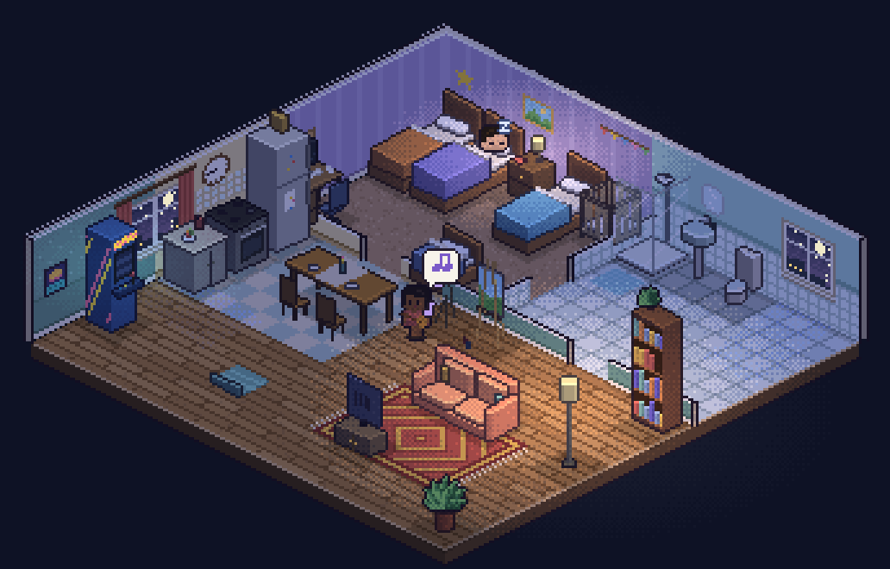

# Little Life

A single-file isometric life simulator. Two adults live in a small flat, meet their
own needs, form a relationship, and may end up with children.

There is no player control beyond speed — it's something you watch, not something
you play.



## Running it

Open [`index.html`](index.html) in a browser. That's it — no build step, no
dependencies, no server. Everything (markup, styles, simulation, and an entirely
procedural canvas renderer) lives in that one file.

## How it works

Each Sim scores every possible action every tick, weighing how urgently a need
(hunger, energy, hygiene, fun, social, bladder) needs attention against the distance
to go do something about it. Mood, personality traits, and a novelty penalty (so
nobody showers four times in a row) all feed into that score. A conversation that
goes well raises a couple's bond; a bond high enough, sealed with a good
conversation, makes them a couple — and a settled couple may have a baby, who grows
into a mobile child a few in-world days later.

Time keeps running while the tab is closed: reopening the page replays the elapsed
time at full simulation fidelity (just without the on-screen logging) rather than
faking a summary, so the household you come back to is one that actually happened.

Rendering is isometric, depth-sorted, and drawn as pixel art, one pixel at a time into a small buffer —
no image assets. See [`CLAUDE.md`](CLAUDE.md) for the internals (the brain, the
render pipeline, the layout invariants) if you're digging into the code.

## Verifying changes

```bash
node verify.js
```

Runs layout-integrity checks (every tile reachable, every piece of furniture
approachable, no overlapping footprints) plus a 22-day headless simulation, and
reports whether a household formed normally with nobody getting stuck.

## Status

A personal project, under active tinkering. Known gaps are tracked in
[`CLAUDE.md`](CLAUDE.md).
